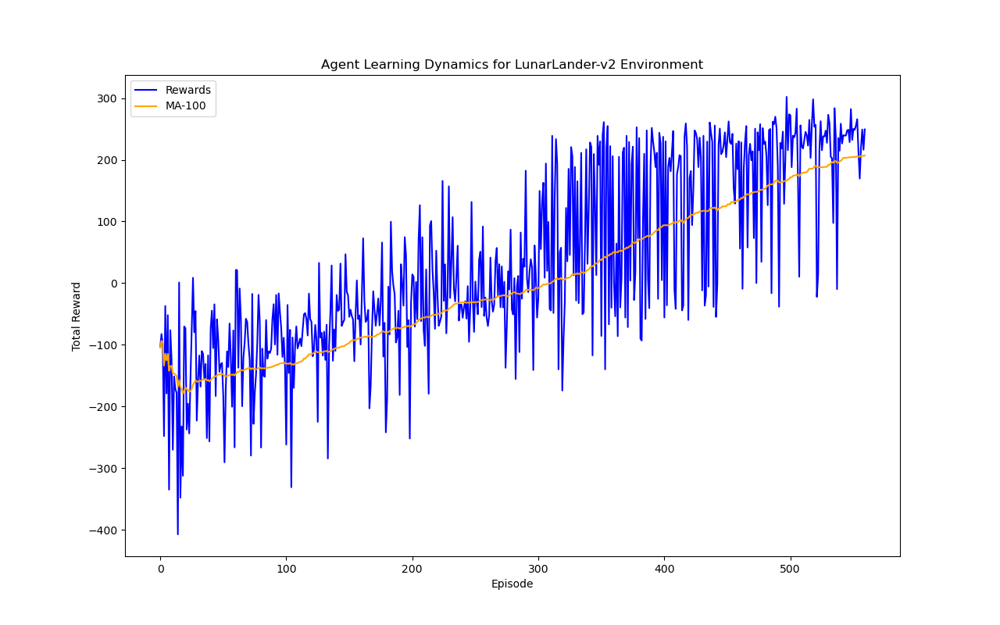
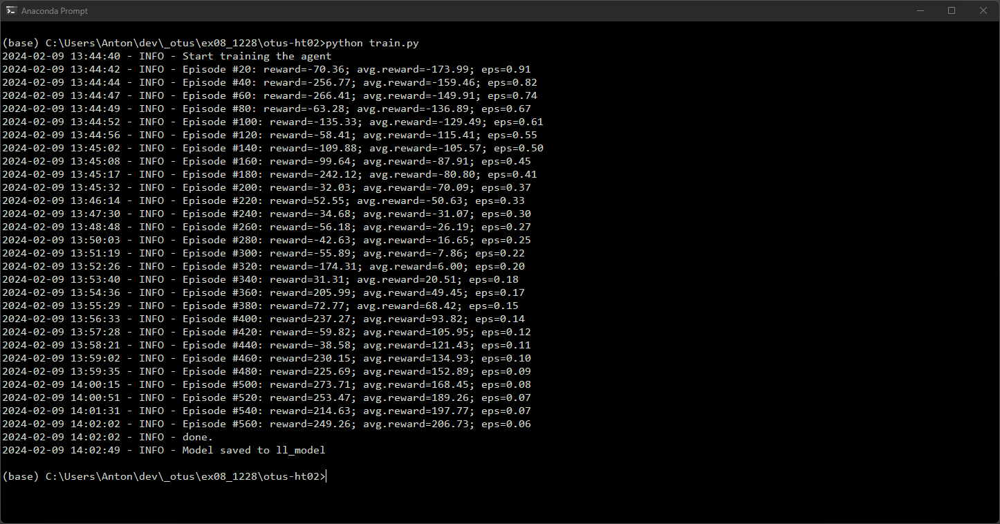
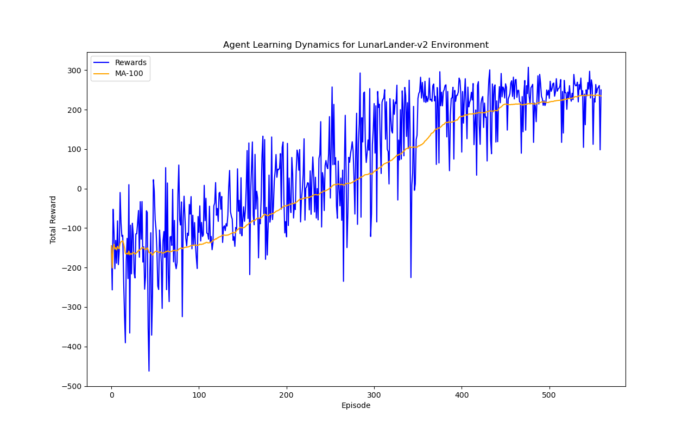
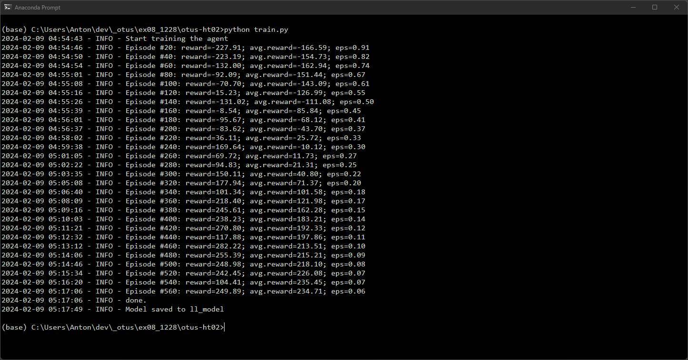

# otus-ht02
## Домашнее задание №2
Задача:
 - реализовать алгоритм DQN с реплей буффером и мягким обновлением весов целевой сети;
 - обучить агента в среде Lunar Lander.
 
 В ходе выполнения задания был реализован реплей буффер - класс ReplayBuffer в модуле buffer.py;
 В модуле dqn.py реализованы классы:
 DQN - реализует сеть Deep Q-network;
 DuelingDQN - реализует сеть для алгоритма Dueling DQN (сеть отличается от обычной DQN тем, что имеет 2 выхода: один для оценки состояния (Value) и второй для оценки преймуществ действий (Advantages));
 Agent - реализует агента для обучения с использованием DQN или DuelingDQN (сам процесс обучения реализован в методе train).

Скрипт train.py обучает агента используя среду LunarLander-v2, выдаёт график динамики обучения - значения наград и скользящее среднее за период n (по умолчанию 100) и сохраняет policy network агента (torch tensor) в файле. Параметры обучения агента задаются в файле .config.yml

В процессе обучения агента с использованием алгоритмов DQN и DuelingDQN, последний показал лучший результат - агент быстрее обучался и достигал более высокого среднего уровня награды.

График обучения с использованием DQN:

Лог обучения агента с использованием DQN:

График обучения с использованием DuelingDQN:

Лог обучения агента с использованием DuelingDQN:

Скрипт run.py загружает сохраннёную policy network агента из файла, запускает агента в среде LunarLander-v2 на 5 эпизодах и выводит визуализацию действий агента - посадку луннного модуля.
Лог запуска обученного агента:

Видео посадки модуля обученным агентом:
<video src='rl-video-episode-10.mp4' width=320/>
